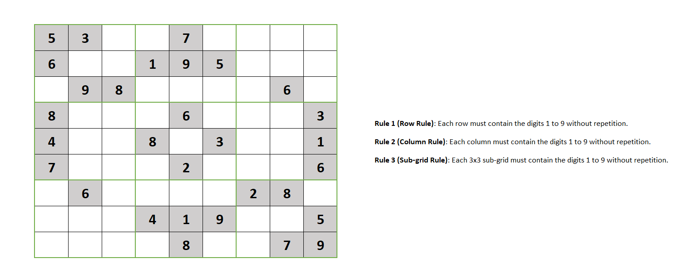

# Sudoku Solver

This project implements a simple Sudoku solver using backtracking in C. The solver reads a Sudoku puzzle, solves it, and prints the solution along with the total steps taken to find the solution.

## Table of Contents

- [Features](#features)
- [Installation](#installation)
- [Usage](#usage)
- [File Structure](#file-structure)
- [How It Works](#how-it-works)
- [Contribution Guidelines](#contribution-guidelines-)
- [General Rules](#general-rules)
- [Getting Started](#getting-started-)
- [Avoiding Conflicts](#avoiding-conflicts-syncing-your-fork)

## Features

- Solves a 9x9 Sudoku puzzle.
- Displays the solved Sudoku grid.
- Shows the total number of steps taken to solve the puzzle.
- Uses a simple text-based user interface.

## Simple Sudoku


## Installation

1. Clone the repository:
   ```bash
   git clone https://github.com/clubgamma/Sudoku.git
   cd Sudoku

2. Compile the code using GCC:
   ```bash
   gcc main.c sudoku.c -o sudoku_solver

## Usage
To run the Sudoku solver:
   ```bash
   ./sudoku_solver
  ```


The program initializes a pre-defined Sudoku puzzle and attempts to solve it. Modify the board array in main.c to test different puzzles.

## File Structure
   ```bash
   Sudoku/
   ├── main.c       # Entry point of the Sudoku solver
   ├── sudoku.h     # Header file containing structure and function declarations
   └── sudoku.c     # Implementation of Sudoku solving logic
  ```

## Description of Files
- **main.c:** Contains the main function and initializes the Sudoku puzzle.
- **sudoku.h:** Defines the Sudoku structure and declares functions used in the solver.
- **sudoku.c:** Implements the logic for checking valid moves, solving the Sudoku, and printing the grid.

## How It Works
- The program initializes a Sudoku board with predefined values.
- It attempts to find an empty cell in the board.
- For each empty cell, it tries placing numbers from 1 to 9.
- If placing a number does not violate Sudoku rules, the program makes a recursive call to solve the rest of the board.
- If a valid solution is found, it prints the completed board and the total steps taken.
- If no solution exists, it informs the user.

# Contribution Guidelines 📚

Welcome to Club Gamma project! We appreciate your interest and contributions. Please read the following guidelines carefully to ensure a smooth collaboration.

## General Rules:

- **Creativity Allowed:** Feel free to submit pull requests that break the rules—we might just merge them anyway!
- **No Build Steps:** Avoid adding build steps like `npm install` to maintain simplicity as a static site.
- **Preserve Existing Content:** Do not remove existing content.
- **Code Style:** Your code can be neat, messy, simple, or complex. As long as it works, it's welcome.
- **Add Your Name:** Remember to add your name to the `contributorsList` file.
- **Keep it Small:** Aim for small pull requests to minimize merge conflicts and streamline reviews.

## Getting Started 🤗🚀

1. **Fork the Repository:**
   - Use the fork button at the top right of the repository page.

2. **Clone Your Fork:**
   - Clone the forked repository to your local machine.

   ```bash
   git clone https://github.com/clubgamma/Internet-Speed-Tester.git
   ```

3. **Navigate to the Project Directory:**

   ```bash
   cd Internet-Speed-Tester
   ```

4. **Create a New Branch:**

   ```bash
   git checkout -b my-new-branch
   ```

5. **Make Your Changes:**
  
   ```bash
   git add .
   ```

6. **Commit Your Changes:**

   ```bash
   git commit -m "Relevant message"
   ```

7. **Push to Your Branch:**

   ```bash
   git push origin my-new-branch
   ```

8. **Create a Pull Request:**
   - Go to your forked repository on GitHub and create a pull request to the main repository.

## Avoiding Conflicts {Syncing Your Fork}

To keep your fork up-to-date with the main repository and avoid conflicts:

1. **Add Upstream Remote:**

   ```bash
   git remote add upstream https://github.com/clubgamma/Sudoku.git
   ```

2. **Verify the New Remote:**

   ```bash
   git remote -v
   ```

3. **Sync Your Fork with Upstream:**

   ```bash
   git fetch upstream
   git merge upstream/main
   ```

   This will pull in changes from the parent repository and help you resolve any conflicts.

4. **Keep Updated:**
   - Regularly pull changes from the upstream repository to keep your fork updated.


###  Add your name
Add your name to the `CONTRIBUTING.md` file using the below convention:

```markdown
#### Name: [YOUR NAME](GitHub link)
- Place: City, State, Country
- Bio: Who are you?
- GitHub: [GitHub account name](GitHub link)
```

We look forward to your contributions and thank you for being a part of our community!
  
